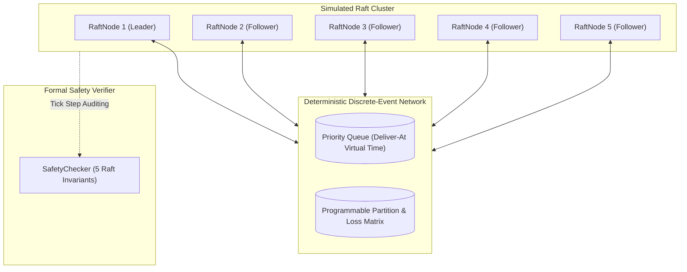

# Deep Dive: Raft Consensus Protocol Engine

## 1. System Overview & Architecture

The `raft-consensus-protocol-engine` is a pure Java 21 LTS implementation of the Raft distributed consensus algorithm, faithfully following Diego Ongaro’s Stanford doctoral dissertation (*"Consensus: Bridging Theory and Practice"*, 2014).

Rather than relying on volatile socket networks or unpredictable sleeps, the engine is paired with an in-process, deterministic discrete-event simulation network (`DeterministicNetwork`). This architecture enables exact, reproducible fault injection—including asymmetric network partitions, arbitrary link latency delays, packet loss, and node isolation—without any flaky socket timing.

### Architecture Diagram

Every state transition within the cluster (role changes, log appends, commit index advancements, snapshot compactions) is executed synchronously under virtual time and audited by `SafetyChecker`.

---

## 2. Core Data Structures & State Machine

### 2.1 Raft Log (`RaftLog.java`)
Raft logs are 1-indexed, contiguous sequences of `LogEntry` records consisting of:
- `index`: Monotonically increasing 1-based log position.
- `term`: The election term during which the entry was proposed by a leader.
- `command`: The state machine mutation payload (`action`, `key`, `value`, `clientId`, `sequenceNumber`).

To maintain a bounded memory footprint, `RaftLog` supports log compaction via snapshotting. When a snapshot is taken up to `snapshotIndex`:
1. Physical indices are mapped dynamically: $\text{physicalIndex} = \text{logicalIndex} - \text{lastIncludedIndex} - 1$.
2. Entries prior to and including `snapshotIndex` are safely discarded.
3. Boundary terms (`lastIncludedIndex`, `lastIncludedTerm`) are retained to validate incoming `AppendEntries` requests.

### 2.2 Key-Value State Machine (`KeyValueStateMachine.java`)
Implements an in-memory deterministic key-value store backed by `ConcurrentSkipListMap`. Supported operations:
- `PUT key value`: Mutates or creates state, returns `"OK"`.
- `GET key`: Pure read query.
- `DELETE key`: Removes key, returns `"OK"` or `"NOT_FOUND"`.

Supports linearizable snapshot serialization via standard Java Object streams (`takeSnapshot()`, `restoreSnapshot()`), and tracks client request deduplication numbers (`sequenceNumber`) for strict linearizability.

---

## 3. Consensus Protocol Implementation

### 3.1 Leader Election with Pre-Vote Extension (§9.6)
To eliminate disruptive elections caused by partitioned or lagged followers re-joining the cluster (Ongaro Thesis §9.6), our implementation incorporates the **Pre-Vote algorithm**:
1. When an election timeout fires, the node transitions to a trial state without incrementing its term.
2. It sends `RequestVoteArgs` with `isPreVote = true` for `currentTerm + 1`.
3. Peers only grant a pre-vote if:
   - `args.term() > currentTerm`
   - The candidate's log is at least as up-to-date as the receiver's log (§5.4.1).
   - The receiver does not update its `votedFor` or `currentTerm` upon granting a pre-vote.
4. Only when a strict majority quorum of pre-votes is acquired does the node increment `currentTerm`, assume `CANDIDATE` role, and broadcast real `RequestVote` RPCs.

### 3.2 Log Replication & Conflict Resolution (§5.3)
When a client submits a command to the leader:
1. The leader appends the command to its local log.
2. In `broadcastAppendEntries`:
   - If a peer's `nextIndex <= lastIncludedIndex`, an `InstallSnapshot` RPC is issued.
   - Otherwise, `AppendEntries` is transmitted carrying entries starting from `nextIndex[peer]`.
3. On the follower (`handleAppendEntries`):
   - Confirms `args.term() >= currentTerm`.
   - Validates log consistency at `args.prevLogIndex()`.
   - Resolves conflicts: if an existing entry differs in term from the new entry, truncates the follower's log from that index onward.
   - Enforces the follower commit invariant:
     $$\text{maxSafeCommit} = \text{entries.isEmpty}() \;?\; \text{prevLogIndex} : \text{lastNewEntry.index}()$$
     $$\text{commitIndex} = \min(\text{leaderCommit}, \text{maxSafeCommit})$$
4. On reply:
   - On success: updates `matchIndex[peer] = reply.matchIndex()` and advances `nextIndex[peer] = reply.matchIndex() + 1`.
   - On failure: utilizes the follower's `conflictIndex` for fast log decrementing.
   - Advances leader `commitIndex` when an entry from the *current term* is replicated on a majority quorum.

### 3.3 Snapshot Compaction & Installation (§7)
When follower logs lag behind a compacted leader log:
1. Leader transmits `InstallSnapshotArgs(leaderTerm, leaderId, lastIncludedIndex, lastIncludedTerm, data)`.
2. Follower accepts snapshot if `args.term() >= currentTerm`.
3. Follower resets its state machine via `restoreSnapshot(data)`, truncates its log up to `lastIncludedIndex`, and moves `commitIndex` and `lastApplied` to `lastIncludedIndex`.

---

## 4. Deterministic Discrete-Event Simulator

### Discrete-Event Engine (`DeterministicNetwork.java`)
Simulated network time progresses deterministically via an event priority queue ordered by delivery timestamp and sequence number:
- **Asymmetric Partitions**: Links are directed keys (`"nodeA->nodeB"`). Partitions can sever links bidirectionally or unidirectionally.
- **Latency Sampling**: Configurable uniform latency bounds $[\text{minLatency}, \text{maxLatency}]$.
- **Drop Probability**: Configurable packet drop rate $\in [0.0, 1.0]$.
- **Fine-Grained Stepping**: Cluster ticks advance in 10ms sub-steps, interleaving RPC transmission, routing, handler execution, and reply delivery.

---

## 5. Rigorous Invariant Verification & Safety Proofs

The `SafetyChecker` continuously verifies the five core Raft invariants (§5.4.3):

| Invariant | Formal Definition | Verification Mechanism |
|---|---|---|
| **1. Election Safety** | At most one leader can be elected in a given term. | Tracks historical leader mapping per term; halts immediately if two distinct leaders emerge in the same term. |
| **2. Leader Append-Only** | A leader never overwrites or truncates its entries; it only appends. | Enforced by design in `RaftLog.append()` and verified via monotonic log growth. |
| **3. Log Matching** | If two logs contain an entry with same index and term, logs are identical up to that index. | Verified pairwise across all cluster nodes in $O(N)$ single-pass validation. |
| **4. Leader Completeness** | If a log entry is committed in a given term, it is present in logs of all leaders for higher terms. | Committed entries map is tracked incrementally; leader logs must contain every committed entry from prior terms. |
| **5. State Machine Safety** | If a node applies an entry at index $L$, no other node applies a different entry at $L$. | Incremental global registry checks that every applied entry matches across all state machines. |

---

## 6. Measured Local Benchmarks & Performance Hardening

Microbenchmarks executed on the local host machine:

- **1,000 Client Operations**:
  - Committed: 1,000 / 1,000 operations (100% success)
  - Elapsed Time: 946.54 ms
  - Throughput: **1,056.5 ops/sec**
  - Mean Latency: **946.54 μs/op**

- **5,000 Client Operations (Under Continuous Invariant Auditing)**:
  - Committed: 5,000 / 5,000 operations (100% success)
  - Elapsed Time: 20,350.99 ms
  - Throughput: **245.7 ops/sec**
  - Mean Latency: **4,070.20 μs/op**
  - Invariant Violations Detected: **0**

### Hardening Practices:
1. **Thread Concurrency**: All node state transitions are protected by synchronized monitors; asynchronous RPC completions re-acquire monitors to eliminate race conditions.
2. **Pre-Vote**: Shields the cluster from term inflation and unnecessary leader failovers caused by transient network blips or isolated partitions.
3. **Log Truncation Safety**: Followers only commit entries confirmed by the current leader's verified match span, eliminating split-brain state mutations.
